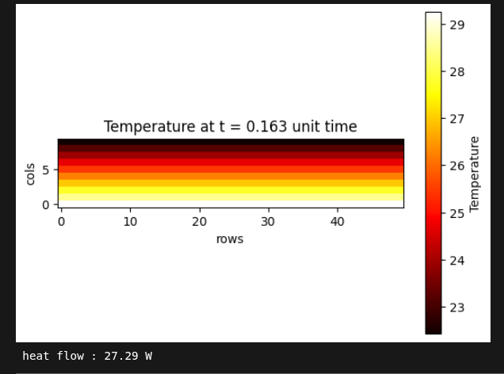

# fdm-2D-heat-equation
Finite Difference Method with python applied on 2D heat equation

## APPLICATION : calculation of a heat flow through a part of a wall

- presentation of the problem <br>


 - install requirements
```bash
pip install requirements.txt
```
- define your params values to the env file

**length** : length of the wall (horizontal) (m) <br>
**larger** : larger of the wall (vertical) (m)<br>
**lambd** : thermal conductivity of the wall (W/m.K)<br>
**delta_xy** : mesh steps (m)<br>
**t_ext** : outside temperature (°C)<br>
**t_int** : inside temperature (°C)<br>
**h_ext** : outside thermal convection coefficient (W/m².K)<br>
**h_int** : inside thermal convection coefficient (W/m².K)<br>
**u_initial** : initial condition everywhere inside the grid (°C)<br>
**max_iter_time** = simulation duration (iteration number) <br>


- run the simulation

```bash
python run.py
```
- results: heat map & heat flow value  <br>


